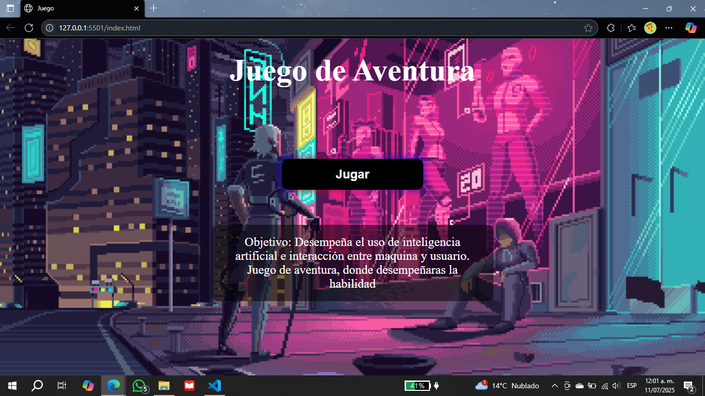
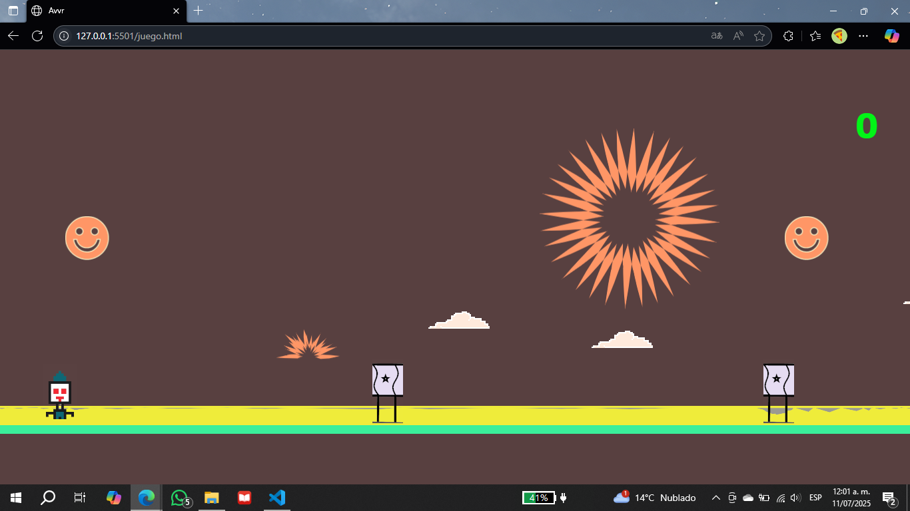
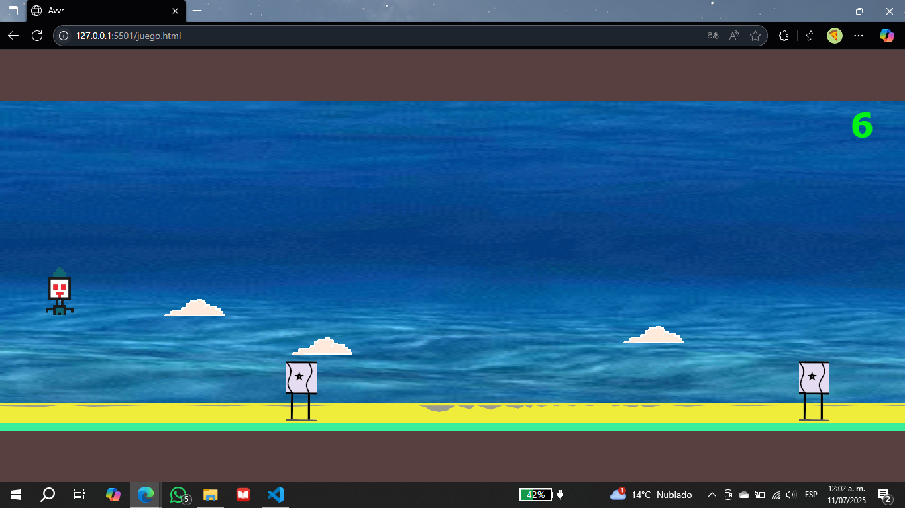

# 🕹️ GameJump

Proyecto desarrollado como trabajo final para una unidad académica en la universidad. Inspirado en el clásico juego del dinosaurio de Google, este juego ofrece una experiencia simple pero entretenida, con diseño visual propio y un sistema de puntuación dinámico.

## 🎮 Descripción

- Juego de plataforma en 2D donde el personaje debe saltar obstáculos utilizando la tecla **espacio**.
- El jugador acumula puntuación (score) mientras más tiempo sobreviva.
- El fondo del juego cambia conforme se avanza, agregando dinamismo visual.
- Diseño visual y mecánicas desarrolladas completamente por los autores.

## 🛠️ Tecnologías utilizadas

- HTML  
- CSS  

## 📂 Estructura del proyecto

```plaintext
GameJump/
├── index.html
├── juego.html
├── README.md
├── styles/
├── img/
├── assets/
│   ├── menu.png
│   ├── juego.png
│   └── salto.png
└── .vscode/
    └── settings.json
```

## 📸 Capturas del juego

### Menú principal  


### Primer escenario  


### Segundo escenario y salto  


## 🚀 ¿Cómo ejecutarlo?
1. Descarga o clona este repositorio.
2. Abre `index.html` en tu navegador o usa Live Server desde Visual Studio Code.
3. ¡Disfruta y trata de superar tu propio récord!

## 👨‍💻 Autor
**Daniel Chagoya**

Desarrollador de Software | Ingeniero en Sistemas Computacionales
[LinkedIn](https://www.linkedin.com/in/daniel-chagoya-58638b321/)

## 👥 Créditos adicionales
**Fernando Méndez Ruiz** – colaboración en diseño y desarrollo
